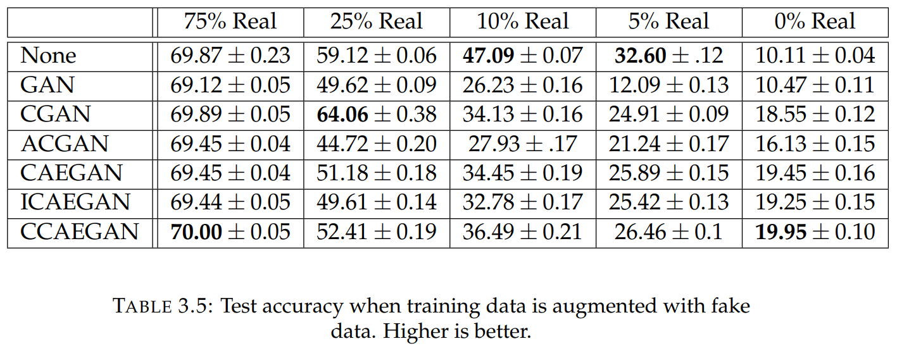

# Cycles Improve Conditional Generators

Conditional Generative Adversarial Networks (CGANs) are diversely utilized for data synthesis in applied sciences and natural image tasks. Conditional generative models extend upon data generation to account for labelled data by estimating joint distributions of samples and labels. We present a family of modified CGANs which leverage cycles between prior and data spaces to improve upon baselines for natural image synthesis and natural image classification with three primary contributions. The first is an ablation study proposing three novel architectures for conditional data generation which demonstrate improvement on baseline generation quality for a natural image dataset as well as increasingly small subsets across multiple generative metrics. The second is a novel approach to structure latent representations by learning a paired structured condition space and weakly structured variation space with desirable sampling and supervised learning properties. The third is a discussion of conditional image synthesis metrics with a comparison to alternative methods for evaluating the quality of conditionally-generated images. The alterations to include cycles in conditional generators demonstrate improvements to comparable baseline CGANs across a variety of established and proposed metrics. Additional experiments demonstrate the successes of inducing cycles in conditional GANs for both image synthesis and image classification over comparable models.

Aerial Airport             |  Satellite Archipelago
:-------------------------:|:-------------------------:
  |  

## Novelty
We induce tasks for the meta learner to simultaneously opimize by compositing augmentations. This composition is given by the factorical boolean matrix which enumerates all possible combinations of seven common image transformations:

## Data Sets
* CIFAR-10: https://www.cs.toronto.edu/~kriz/cifar.html
- 60,000 32x32 color images in 10 classes

## Results

CNN with augmentation outperforms CNN and MAML             |  MAML behaves like augmented CNN
:-------------------------:|:-------------------------:
  |  

## Challenges
- Image variance in scale and resolution
- Inter- and intra-class variance
- Multiple objects within scenes
- High number of classes
- Resizing dataset reduces discriminability
- Class overlap in style and content

